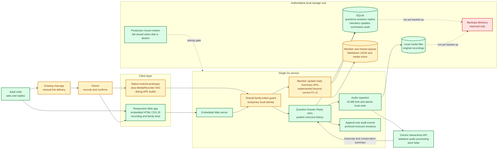
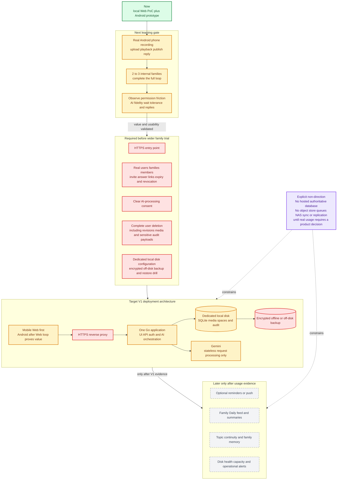

# Family Daily Architecture Diagram

> Updated: 2026-08-22
> Scope: current implementation and staged future direction

## Status legend

- Green: implemented and locally verified
- Yellow: implemented prototype, still needs real-device or real-family proof
- Red: required before family trial
- Gray dashed: later direction, not part of the current MVP

## Current architecture

## Future direction by learning stage

## Architectural boundary

The V1 architecture stays intentionally small: clients call one Go service; the service writes all authoritative family data to SQLite and local media files before or alongside stateless Gemini processing. The next architecture work is identity, consent, deletion, HTTPS, dedicated-disk setup, and recoverable backup—not distributed infrastructure.
