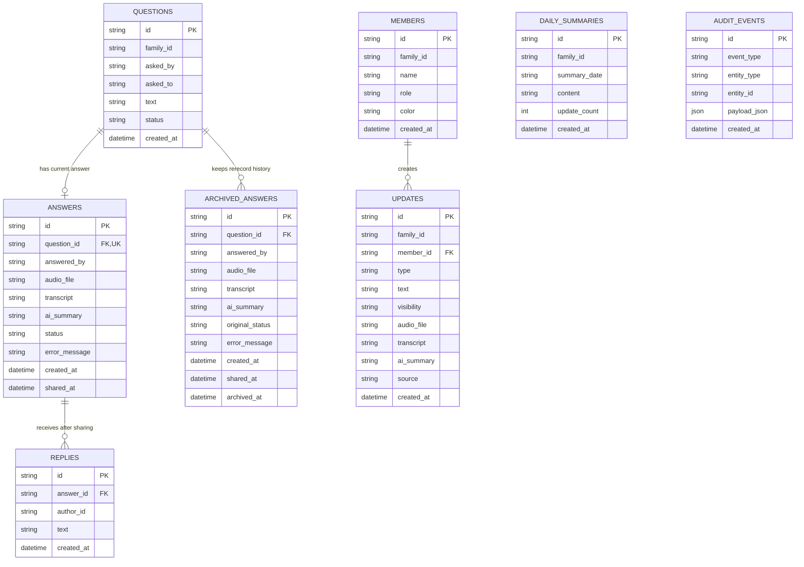
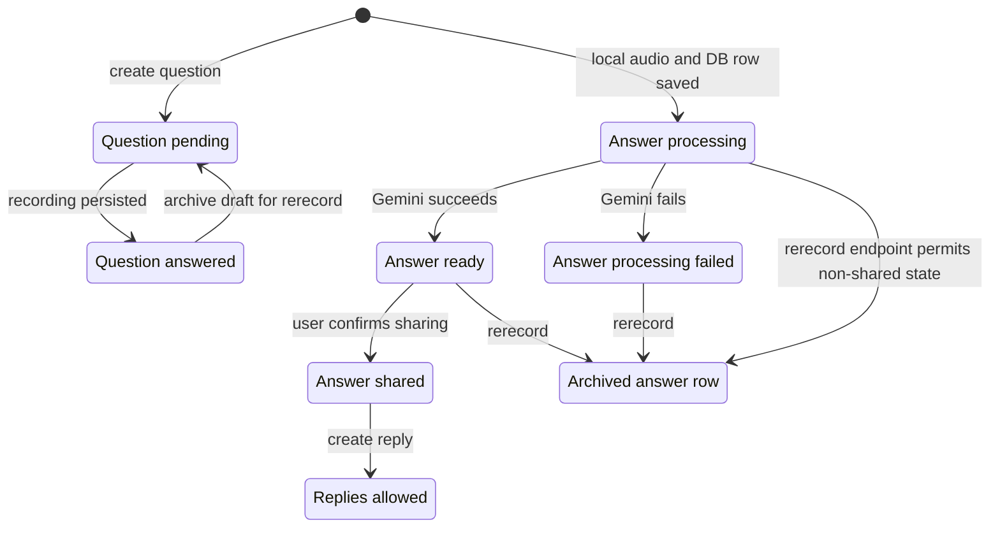

# Family Daily Backend Data Structure

> Generated from the current Go migrations and persistence code on 2026-08-22.
> This document describes the implementation as it exists; it is not a proposed replacement schema.

## 1. SQLite entity relationship diagram



The diagram only draws enforced foreign keys. The following are logical references stored as plain text and are not constrained by SQLite:

- `questions.family_id`, `members.family_id`, `updates.family_id`, and `daily_summaries.family_id` refer to a family, but no `families` table exists.
- `questions.asked_by`, `questions.asked_to`, `answers.answered_by`, and `replies.author_id` are display strings, not foreign keys to `members`.
- `audit_events.entity_type + entity_id` is a polymorphic logical reference with no foreign key.
- A daily summary is selected from updates by family, visibility, and calendar date, but the included update IDs are not persisted.

## 2. Model groups and current product status

| Model group | Tables | Current role | Status |
| --- | --- | --- | --- |
| P1 communication loop | `questions`, `answers`, `archived_answers`, `replies` | Question → recorded answer → AI result → confirmation → reply | Implemented and covered by backend tests |
| Traceability | `audit_events` | Append state-change payloads and reconstruct question/answer history | Implemented; permanent erasure semantics remain unresolved |
| Family context expansion | `members`, `updates`, `daily_summaries` | Member spaces, text/voice updates, family summaries | Backend APIs exist; not part of the current P1 Web experience |
| Family and identity | No dedicated tables | Currently represented by `family_id` and free-form names | Temporary prototype only |

## 3. Core state transitions



Current values used by the code:

- `questions.status`: `pending`, `answered`
- `answers.status`: `processing`, `ready`, `processing_failed`, `shared`
- `members.role`: `member`, `elder`
- `updates.type`: currently `text`, `voice`
- `updates.visibility`: `private`, `family`
- `updates.source`: currently `member`, `member_voice`, `member_voice_processing_failed`

These values are validated in application code where applicable, but the database has no `CHECK` constraints.

## 4. Authoritative storage layout

```text
<FAMILY_DAILY_STORAGE_DIR>/
├── .family-daily-storage          # required production mount marker
├── family-daily.db                # authoritative SQLite database
├── family-daily.db-wal
├── family-daily.db-shm
├── media/                         # recordings for question answers
│   └── <answer-id>.<extension>
├── backups/                       # reserved; backup is not implemented
└── spaces/                        # member/update expansion model
    ├── members/
    │   └── <member-id>/
    │       ├── profile.json
    │       ├── private/
    │       ├── updates/
    │       │   └── <update-id>.md
    │       ├── media/
    │       │   └── <update-id>.<extension>
    │       ├── summaries/
    │       └── jobs/
    └── shared/
        ├── updates/
        │   └── <update-id>.json
        ├── media/
        ├── summaries/
        │   └── <date>-<summary-id>.md
        └── sources/
```

SQLite is the application index and source for API reads. The question-answer audio files and the member-space files are durable local artifacts. Gemini processes request data statelessly and is not an authoritative store.

## 5. Write paths and consistency boundaries

```mermaid
flowchart TD
    subgraph answer[Question answer path]
        A1[Write audio atomically] --> A2[Insert processing answer and audit]
        A2 --> A3[Call Gemini]
        A3 --> A4[Update ready or failed status and audit]
    end

    subgraph update[Member update path]
        U1[Write media when voice] --> U2[Write member-space Markdown or JSON]
        U2 --> U3[Insert SQLite update and audit]
    end

    subgraph summary[Daily summary path]
        S1[Read visible updates by date] --> S2[Call Gemini]
        S2 --> S3[Write summary Markdown]
        S3 --> S4[Insert SQLite summary and audit]
    end
```



- The answer path removes the newly written audio if creation of the initial SQLite row fails.
- Member creation, member updates, voice updates, and daily summaries write files before the SQLite transaction. If the later database write fails, an orphan file can remain.
- SQLite uses one open connection, WAL journal mode, `synchronous=FULL`, foreign keys, and a 5-second busy timeout.
- Re-recording intentionally preserves old audio and copies the answer row into `archived_answers` before deleting the current row.

## 6. Review findings

### Must resolve before real multi-family use

1. **Family isolation is not enforced by the data model or Q&A queries.** `listQuestions` returns every family, question lookup checks only the question ID, and one shared API token protects the whole service. This is acceptable only for the current single-family prototype.
2. **Q&A identity is disconnected from `members`.** Names are free-form strings, so rename, duplicate names, authorization, invitation membership, and reliable ownership cannot be enforced.
3. **There is no `families` entity.** Family configuration, membership, invite lifecycle, and per-family authorization have no authoritative relational home yet.

### Must resolve before permanent deletion is offered

4. **Audit payloads duplicate sensitive content.** Some events store complete answers, transcripts, summaries, replies, and member data. Permanent erasure must redact or replace those payloads while retaining a content-free deletion receipt.
5. **Files and SQLite are not one transaction.** Several expansion-model writes can leave orphan files after partial failure. A reconciliation strategy or a recoverable pending-write state is needed before relying on those paths.
6. **File ownership is implicit.** Media filenames are stored in database rows, but there is no dedicated media table recording owner, size, hash, MIME type, lifecycle state, or deletion status.

### Important schema decisions before expanding the product

7. **Schema migration versioning is absent.** Startup only runs idempotent `CREATE TABLE/INDEX IF NOT EXISTS`; it cannot safely express future column changes or data backfills.
8. **Status and enum constraints live only in Go.** Invalid values could enter through manual operations or future code paths.
9. **Daily-summary provenance is lossy.** Only `family_id`, date, and `update_count` are stored, so the exact input update set cannot be audited later.
10. **Two content models overlap.** `questions/answers/replies` power the validated P1 loop, while `updates/daily_summaries/spaces` point toward the broader Family Daily vision. A product decision is needed before merging them or building more UI on the second model.

## 7. Recommended review order

1. Confirm that the question-answer-reply model remains the sole P1 product core.
2. Decide whether real identity should reference `members`, or whether a new `users + families + family_memberships` model is required.
3. Define family-scoped authorization before adding a second real family.
4. Define deletion across current rows, archived rows, audit payloads, and both media roots.
5. Decide whether `updates/daily_summaries/spaces` should remain deferred, be removed for now, or become a later migration target.
